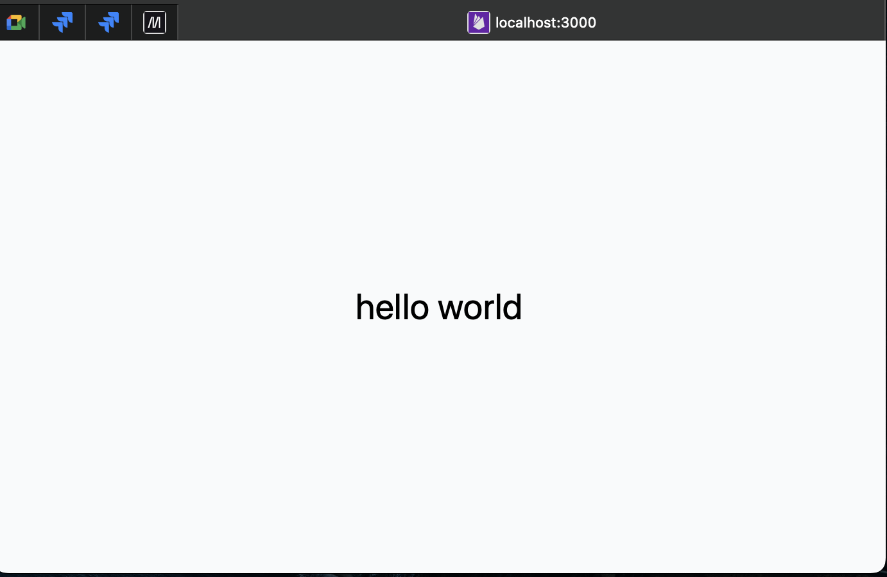

# Nextjs

```
npx create-next-app@latest day3
```

# Prettier

```
npm install -D prettier
echo "{}" > .prettierc.json
```

# Tailwind

[Link](https://tailwindcss.com/docs/guides/nextjs)

## install

```
npm install -D tailwindcss postcss autoprefixer
```

## generate tailwind.config.js and postcss.config.js

```
npx tailwindcss init -p
```

## config tailwind.config.js

```
/** @type {import('tailwindcss').Config} */
module.exports = {
  content: [
    "./pages/**/*.{js,ts,jsx,tsx}",
    "./components/**/*.{js,ts,jsx,tsx}",
  ],
  theme: {
    extend: {},
  },
  plugins: [],
}
```

## edit ./styles/globals.css

```
@tailwind base;
@tailwind components;
@tailwind utilities;
```

## edit pages/index.js

```
export default function Home() {
  return (
    <div className="bg-gray-50 h-screen flex items-center">
      <div className="mx-auto">hello world</div>
    </div>
  );
}
```

## edit pages/\_app.js

```
import "../styles/globals.css";

function MyApp({ Component, pageProps }) {
  return <Component {...pageProps} />;
}

export default MyApp;

```

## Expection

หลังจากสั่ง `npm run dev` จะพบหน้า

